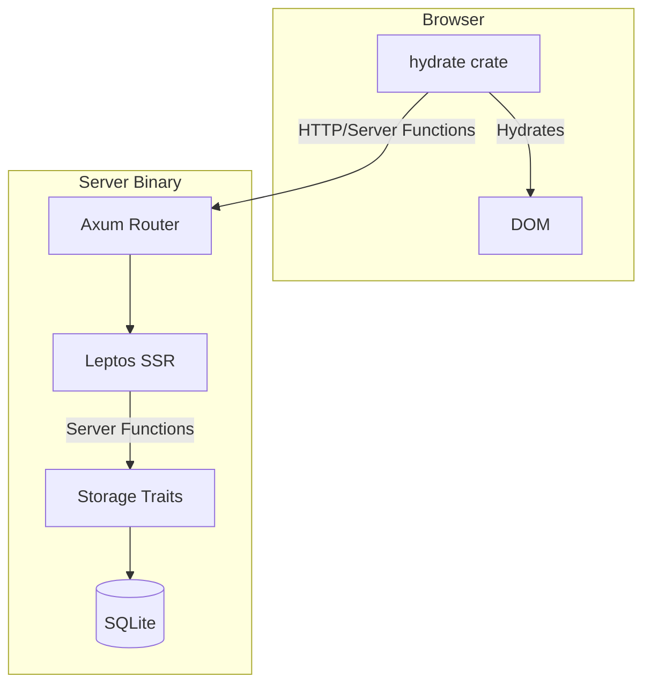

# Architecture

Jaunder is a full-stack Rust application built with the [Leptos](https://leptos.dev/) framework. It follows a single-binary deployment model with a decoupled storage layer.

## Crate Responsibilities

The workspace is divided into three primary crates:

| Crate | Target | Responsibility |
|-------|--------|----------------|
| `server` | Binary / Lib | Axum web server, SQLite storage, CLI commands, and SSR (Server-Side Rendering). |
| `web` | Library | Shared frontend logic: components, routing, and reactive state. Compiled to both native and WASM. |
| `hydrate` | WASM Binary | Thin wrapper around `web` that "hydrates" the static HTML sent by the server in the browser. |

## Component Overview

## Data Flow & Storage

### Storage Traits

Persistence is abstracted behind traits in `server/src/storage/mod.rs`:

- `SiteConfigStorage`: Key-value configuration.
- `UserStorage`: User account management.
- `SessionStorage`: Session token lifecycle.
- `InviteStorage`: Invite code management.

All concrete implementations (e.g., `SqliteUserStorage`) are hidden from the application logic. The `server` crate provides an `AppState` struct that bundles these traits as `Arc<dyn Trait>` objects.

### Cross-Table Transactions

While individual traits handle single-table operations, some business logic spans multiple tables (e.g., creating a user while simultaneously marking an invite code as used).

These operations are implemented as **free functions** in the `storage` module that accept a raw `SqlitePool`. This allows them to execute atomic transactions across boundaries that the individual trait objects cannot see.

## Authentication

Jaunder uses two authentication mechanisms:

1.  **Session Cookies**: Primary for the web frontend.
2.  **Bearer Tokens**: Used by API clients and mobile apps.

Both are handled by the `AuthUser` Axum extractor, which resolves tokens via the `SessionStorage` trait. Inside Leptos server functions, `require_auth()` provides a unified way to access the current user.
