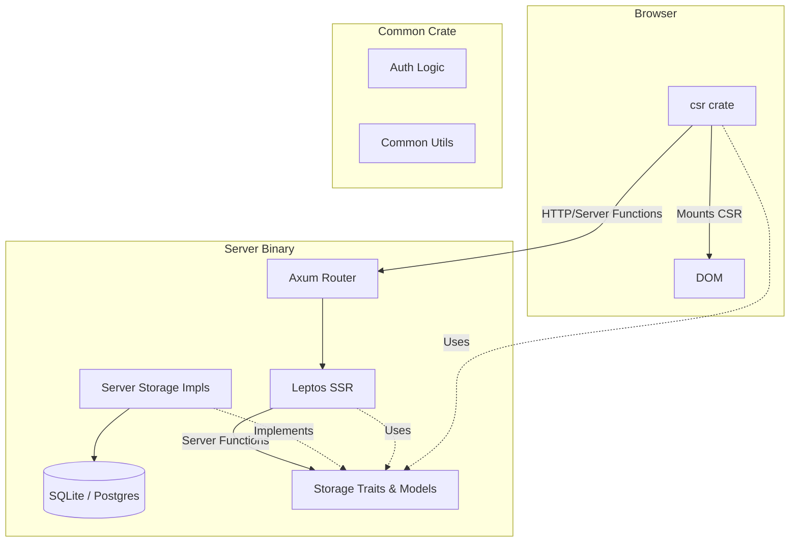

# Architecture

Jaunder is a full-stack Rust application built with the
[Leptos](https://leptos.dev/) framework (see
[ADR-0002](decisions/0002-frontend-framework.md)). It follows a single-binary
deployment model (see [ADR-0008](decisions/0008-deployment-model.md)) with a
decoupled storage layer (see [ADR-0001](decisions/0001-storage-backends.md)).

## Crate Responsibilities

The workspace is divided into four primary crates:

| Crate    | Target       | Responsibility                                                                                                             |
| -------- | ------------ | -------------------------------------------------------------------------------------------------------------------------- |
| `server` | Binary / Lib | Axum web server, storage implementations (SQLite/Postgres), CLI commands, and SSR (Server-Side Rendering).                 |
| `web`    | Library      | Shared frontend logic: components, routing, and reactive state. Compiled to both native and WASM.                          |
| `csr`    | WASM Binary  | Browser entry point: boots the client-side-rendered (CSR) bundle, mounting `web::App` via `web::mount_csr()`.              |
| `common` | Library      | Shared logic and data structures: storage traits, auth types, mailer, and utility modules used by both `server` and `web`. |

## Component Overview

## Data Flow & Storage

Persistence is abstracted behind traits defined in the `common` crate
(`common/src/storage/`). This prevents circular dependencies between the
`server` and `web` crates and allows the application to remain agnostic of the
underlying database engine (see [ADR-0001](decisions/0001-storage-backends.md)).

Jaunder uses a tiered storage architecture to isolate user data from shared
network content (see [ADR-0006](decisions/0006-storage-isolation.md)).

### Storage Abstraction

The storage layer is divided into functional modules, each defining a trait for
operations on a specific domain (e.g., `UserStorage`, `PostStorage`). These
traits, along with their associated data models and error types, are the
definitive interface for persistence in Jaunder.

The [**`common/src/storage/`**](../common/src/storage/) directory is the single
source of truth for these interfaces. Developers should consult the doc comments
in that directory for the most up-to-date definitions of:

- **Domain Traits**: Core interfaces for users, posts, sessions, etc.
- **Atomic Operations**: Cross-table transactions that span multiple traits.
- **Data Records**: Normalized models returned by storage queries.
- **App State**: The centralized bundle of all storage handles used by the
  application.

### Cross-Table Transactions

While individual traits handle single-table operations, some business logic
spans multiple tables. These operations are implemented as **free functions** in
the server's storage module that accept a raw database pool, allowing for atomic
transactions across trait boundaries.

## Authentication

Jaunder supports two authentication mechanisms to accommodate both web and API
clients (see [ADR-0007](decisions/0007-auth-mechanisms.md)):

1.  **Session Cookies**: Primary for the web frontend.
2.  **Bearer Tokens**: Used by API clients and mobile apps.

Both are handled by the `AuthUser` Axum extractor, which resolves tokens via the
`SessionStorage` trait. Inside Leptos server functions, `require_auth()`
provides a unified way to access the current user.

## Observability

Jaunder implements a unified observability strategy using OpenTelemetry to
correlate events across the backend and the end-to-end test runner (see
[ADR-0011](decisions/0011-unified-observability.md)).

### Tracing Layers

1.  **Backend**: Rust spans produced via `tracing` in the `server` crate.
2.  **E2E (Automatic)**: Per-test spans capturing navigation, actions, and
    resource summaries.
3.  **E2E (Semantic)**: Manual flow timing for domain-specific analysis.

Trace context is propagated via the `JAUNDER_E2E_TRACEPARENT` header, allowing
Playwright spans to be parented to the corresponding backend operations.

### Trace Output Locations

In E2E VM checks, traces are exported to an in-VM collector and persisted under
the `JAUNDER_CAPTURE_DIR` contract (#332):

- `/var/lib/jaunder/capture/otel-traces.jsonl` (inside the VM)
- lifted per combo inside `capture-<backend>.tar.gz`, alongside `diag.log` and
  the mail/websub JSONL

## Tooling & Diagnostics

The project includes specialized tools for analyzing system behavior and
performance:

- **`cargo xtask traces analyze`**: Processes JSONL trace artifacts to report on
  slowest spans, action/long-task hotspots, and navigation phase bottlenecks.
- **`cargo xtask traces run`**: Builds the e2e VM checks and runs
  `traces analyze` on their exported traces in one step.
- **`cargo xtask audit-wasm`**: Measures deterministic WASM bundle sizes (raw,
  gzip, brotli) from Nix build outputs.

See [CONTRIBUTING.md](../CONTRIBUTING.md) for detailed usage of these tools
during development.
