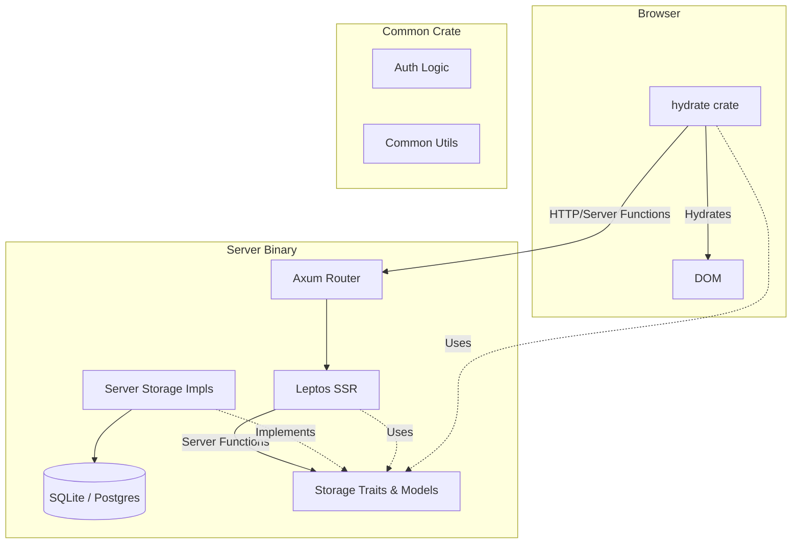

# Architecture

Jaunder is a full-stack Rust application built with the [Leptos](https://leptos.dev/) framework (see [ADR-0002](decisions/0002-frontend-framework.md)). It follows a single-binary deployment model (see [ADR-0008](decisions/0008-deployment-model.md)) with a decoupled storage layer (see [ADR-0001](decisions/0001-storage-backends.md)).

## Crate Responsibilities

The workspace is divided into four primary crates:

| Crate | Target | Responsibility |
|-------|--------|----------------|
| `server` | Binary / Lib | Axum web server, storage implementations (SQLite/Postgres), CLI commands, and SSR (Server-Side Rendering). |
| `web` | Library | Shared frontend logic: components, routing, and reactive state. Compiled to both native and WASM. |
| `hydrate` | WASM Binary | Thin wrapper around `web` that "hydrates" the static HTML sent by the server in the browser. |
| `common` | Library | Shared logic and data structures: storage traits, auth types, mailer, and utility modules used by both `server` and `web`. |

## Component Overview

## Data Flow & Storage

Persistence is abstracted behind traits defined in the `common` crate (`common/src/storage/`). This prevents circular dependencies between the `server` and `web` crates. Jaunder uses a tiered storage architecture to isolate user data from shared network content (see [ADR-0006](decisions/0006-storage-isolation.md)).

### Storage Traits

Traits are defined in `common` and re-exported by `server/src/storage/mod.rs` for convenience:

- `SiteConfigStorage`: Key-value configuration.
- `UserStorage`: User account management.
- `SessionStorage`: Session token lifecycle.
- `InviteStorage`: Invite code management.

All concrete implementations (e.g., `SqliteUserStorage`) are hidden from the application logic. The `server` crate provides an `AppState` struct that bundles these traits as `Arc<dyn Trait>` objects.

### Cross-Table Transactions

While individual traits handle single-table operations, some business logic spans multiple tables. These operations are implemented as **free functions** in the `storage` module that accept a raw database pool, allowing for atomic transactions across trait boundaries.

## Authentication

Jaunder supports two authentication mechanisms to accommodate both web and API clients (see [ADR-0007](decisions/0007-auth-mechanisms.md)):

1.  **Session Cookies**: Primary for the web frontend.
2.  **Bearer Tokens**: Used by API clients and mobile apps.

Both are handled by the `AuthUser` Axum extractor, which resolves tokens via the `SessionStorage` trait. Inside Leptos server functions, `require_auth()` provides a unified way to access the current user.
