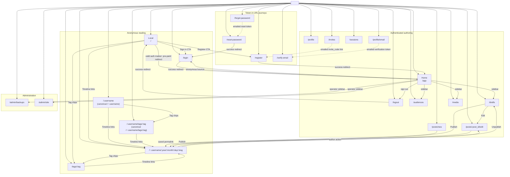

# CSR flow index

`docs/flows/` is the route-and-journey companion to the CSR matrix. The matrix
stays the only flow-to-Playwright evidence map; these docs explain how mounted
routes and server functions fit into one user-visible journey.

## Flow documents

| Flow                                     | Document                                                                         |
| ---------------------------------------- | -------------------------------------------------------------------------------- |
| Application shell and boot state         | [`application-shell-and-boot-state.md`](application-shell-and-boot-state.md)     |
| Public reading                           | [`public-reading.md`](public-reading.md)                                         |
| Authenticated cockpit                    | [`authenticated-cockpit.md`](authenticated-cockpit.md)                           |
| Authentication                           | [`authentication.md`](authentication.md)                                         |
| Profile and email verification           | [`profile-email-verification.md`](profile-email-verification.md)                 |
| App password management                  | [`app-password-management.md`](app-password-management.md)                       |
| Audiences, subscriptions, and visibility | [`audiences-subscriptions-visibility.md`](audiences-subscriptions-visibility.md) |
| Invitation registration                  | [`invitation-registration.md`](invitation-registration.md)                       |
| Administration                           | [`administration.md`](administration.md)                                         |
| Post authoring lifecycle                 | [`post-authoring-lifecycle.md`](post-authoring-lifecycle.md)                     |
| Media management                         | [`media-management.md`](media-management.md)                                     |
| Password reset                           | [`password-reset.md`](password-reset.md)                                         |
| Tag browsing                             | [`tag-browsing.md`](tag-browsing.md)                                             |
| Theme management                         | [`theme-management.md`](theme-management.md)                                     |

## Route map

All mounted children render under the shared shell. A browser with a live
session but no marker may paint Local once; reconciliation restores the marker
and replaces it with Home. A stale marker instead follows `/` → `/app` →
`/login`. The fallback route and protocol-only surfaces stay out of this map.
The inbound-only `GET /YYYY/MM/DD/slug` WordPress-compatible alias is likewise
absent: it is a server HTTP redirect before CSR boot, not a mounted route or a
canonical navigation target.

## Mounted route declarations

| Region                  | Mounted route declarations                                                                                                                                                                                          | Current document                                                                                                                                                 |
| ----------------------- | ------------------------------------------------------------------------------------------------------------------------------------------------------------------------------------------------------------------- | ---------------------------------------------------------------------------------------------------------------------------------------------------------------- |
| Shared shell            | `route:<shell>`                                                                                                                                                                                                     | [`application-shell-and-boot-state.md`](application-shell-and-boot-state.md)                                                                                     |
| Anonymous reading       | `route:/`, `route:/login`, `route:/:username`, `route:/~:username/:year/:month/:day/:slug`, `route:/tags/:tag`, `route:/:username/tags/:tag`                                                                        | [`public-reading.md`](public-reading.md), [`tag-browsing.md`](tag-browsing.md)                                                                                   |
| Authenticated authoring | `route:/app`, `route:/logout`, `route:/profile`, `route:/profile/email`, `route:/sessions`, `route:/audiences`, `route:/invites`, `route:/posts/new`, `route:/drafts`, `route:/posts/:post_id/edit`, `route:/media` | [`authenticated-cockpit.md`](authenticated-cockpit.md), [`app-password-management.md`](app-password-management.md), [`media-management.md`](media-management.md) |
| Token-in-URL journeys   | `route:/register`, `route:/verify-email`, `route:/forgot-password`, `route:/reset-password`                                                                                                                         | Current docs                                                                                                                                                     |
| Administration          | `route:/admin/backups`, `route:/admin/site`                                                                                                                                                                         | [`administration.md`](administration.md)                                                                                                                         |

Canonical user URLs keep the tilde in rendered links (`/~:username`,
`/~:username/tags/:tag`, and the full permalink pattern), but the mounted user
and user-tag matchers remain `route:/:username` and `route:/:username/tags/:tag`
because those are the router patterns derived from `ParamSegment("username")`.

The route census lists CSR-mounted declarations only. A direct HTTP request to
`/YYYY/MM/DD/slug` has no route token: it is the server-owned, inbound-only
compatibility alias documented in [`public-reading.md`](public-reading.md),
which may redirect to the canonical `/~:username/:year/:month/:day/:slug` route
before the client mounts.
