# CSR flow index

`docs/flows/` is the route-and-journey companion to the CSR matrix. The matrix
stays the only flow-to-Playwright evidence map; these docs explain how mounted
routes and server functions fit into one user-visible journey.

## Flow documents

| Flow                                     | Document                                                                         |
| ---------------------------------------- | -------------------------------------------------------------------------------- |
| Application shell and boot state         | [`application-shell-and-boot-state.md`](application-shell-and-boot-state.md)     |
| Public reading                           | Task 3 pending                                                                   |
| Authenticated cockpit                    | Task 3 pending                                                                   |
| Authentication                           | [`authentication.md`](authentication.md)                                         |
| Profile and email verification           | [`profile-email-verification.md`](profile-email-verification.md)                 |
| App password management                  | Task 3 pending                                                                   |
| Audiences, subscriptions, and visibility | [`audiences-subscriptions-visibility.md`](audiences-subscriptions-visibility.md) |
| Invitation registration                  | [`invitation-registration.md`](invitation-registration.md)                       |
| Administration                           | Task 3 pending                                                                   |
| Post authoring lifecycle                 | [`post-authoring-lifecycle.md`](post-authoring-lifecycle.md)                     |
| Media management                         | Task 3 pending                                                                   |
| Password reset                           | [`password-reset.md`](password-reset.md)                                         |
| Tag browsing                             | Task 3 pending                                                                   |

## Route map

```mermaid
graph TD
    shell["<shell>"]

    subgraph Anonymous reading
        home["/"]
        login["/login"]
        publicUser["/:username<br/>(canonical /~:username)"]
        publicPost["/~:username/:year/:month/:day/:slug"]
        siteTag["/tags/:tag"]
        userTag["/:username/tags/:tag<br/>(canonical /~:username/tags/:tag)"]
    end

    subgraph Authenticated authoring
        app["/app"]
        logout["/logout"]
        profile["/profile"]
        profileEmail["/profile/email"]
        sessions["/sessions"]
        audiences["/audiences"]
        invites["/invites"]
        postsNew["/posts/new"]
        drafts["/drafts"]
        postEdit["/posts/:post_id/edit"]
        media["/media"]
    end

    subgraph Token-in-URL journeys
        register["/register"]
        verifyEmail["/verify-email"]
        forgotPassword["/forgot-password"]
        resetPassword["/reset-password"]
    end

    subgraph Administration
        adminBackups["/admin/backups"]
        adminSite["/admin/site"]
    end

    shell --> home
    shell --> login
    shell --> register
    shell --> forgotPassword
    shell --> publicUser
    shell --> publicPost
    shell --> siteTag
    shell --> userTag
    shell --> app
    shell --> logout
    shell --> profile
    shell --> profileEmail
    shell --> sessions
    shell --> audiences
    shell --> invites
    shell --> postsNew
    shell --> drafts
    shell --> postEdit
    shell --> media
    shell --> verifyEmail
    shell --> resetPassword
    shell --> adminBackups
    shell --> adminSite

    home -->|Sign in CTA| login
    home -->|Register CTA| register
    home -->|Timeline links| publicPost
    home -->|Tag chips| siteTag
    home -->|home_redirect=app| app

    app -->|anonymous bounce| login
    app -->|sidebar| drafts
    app -->|sidebar| audiences
    app -->|sidebar| media
    app -->|operator sidebar| adminBackups
    app -->|operator sidebar| adminSite
    app -->|sign out| logout

    publicUser -->|Timeline links| publicPost
    publicUser -->|Tag chips| userTag
    userTag -->|Timeline links| publicPost
    siteTag -->|Timeline links| publicPost
    publicPost -->|Tag chips| siteTag
    publicPost -->|author action| postEdit

    postsNew -->|saved permalink| publicPost
    drafts -->|Edit| postEdit
    drafts -->|Publish| publicPost
    postEdit -->|Publish| publicPost
    publicPost -->|Unpublish| drafts

    login -->|success redirect| home
    register -->|success redirect| home
    logout -->|success redirect| home
    resetPassword -->|success redirect| login

    invites -. emailed invite_code link .-> register
    profileEmail -. emailed verification token .-> verifyEmail
    forgotPassword -. emailed reset token .-> resetPassword
```

All mounted children render under the shared shell. The fallback route and
protocol-only surfaces stay out of this map.

## Mounted route declarations

| Region                  | Mounted route declarations                                                                                                                                                                                          | Current document                                                                                                          |
| ----------------------- | ------------------------------------------------------------------------------------------------------------------------------------------------------------------------------------------------------------------- | ------------------------------------------------------------------------------------------------------------------------- |
| Shared shell            | `route:<shell>`                                                                                                                                                                                                     | [`application-shell-and-boot-state.md`](application-shell-and-boot-state.md)                                              |
| Anonymous reading       | `route:/`, `route:/login`, `route:/:username`, `route:/~:username/:year/:month/:day/:slug`, `route:/tags/:tag`, `route:/:username/tags/:tag`                                                                        | Task 3 pending (`public-reading.md`, `tag-browsing.md`)                                                                   |
| Authenticated authoring | `route:/app`, `route:/logout`, `route:/profile`, `route:/profile/email`, `route:/sessions`, `route:/audiences`, `route:/invites`, `route:/posts/new`, `route:/drafts`, `route:/posts/:post_id/edit`, `route:/media` | Mixed: current docs plus Task 3 pending (`authenticated-cockpit.md`, `app-password-management.md`, `media-management.md`) |
| Token-in-URL journeys   | `route:/register`, `route:/verify-email`, `route:/forgot-password`, `route:/reset-password`                                                                                                                         | Current docs                                                                                                              |
| Administration          | `route:/admin/backups`, `route:/admin/site`                                                                                                                                                                         | Task 3 pending (`administration.md`)                                                                                      |

Canonical user URLs keep the tilde in rendered links (`/~:username`,
`/~:username/tags/:tag`, and the full permalink pattern), but the mounted user
and user-tag matchers remain `route:/:username` and `route:/:username/tags/:tag`
because those are the router patterns derived from `ParamSegment("username")`.
