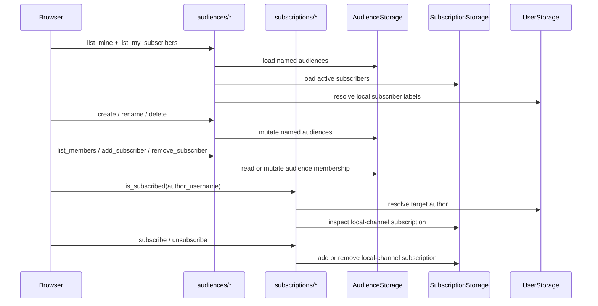

# Audiences, subscriptions, and visibility

Matrix:
`matrix:docs/coverage/csr-e2e-matrix.md#audiences-subscriptions-and-visibility`

## Routes

- `route:/audiences`
- `route:/posts/new`
- `route:/posts/:post_id/edit`
- `route:/:username`
- `route:/~:username/:year/:month/:day/:slug`

## Endpoints

- `endpoint:/api/audiences/create`
- `endpoint:/api/audiences/rename`
- `endpoint:/api/audiences/delete`
- `endpoint:/api/audiences/list_mine`
- `endpoint:/api/audiences/list_my_subscribers`
- `endpoint:/api/audiences/add_subscriber`
- `endpoint:/api/audiences/remove_subscriber`
- `endpoint:/api/audiences/list_members`
- `endpoint:/api/subscriptions/is_subscribed`
- `endpoint:/api/subscriptions/subscribe`
- `endpoint:/api/subscriptions/unsubscribe`

`/audiences` is the author-side management screen for named subscriber groups.
Its list of audiences patches a keyed reactive store in place, its subscriber
roster is refreshed through a sticky resource, and each audience row fetches its
own membership list separately so add/remove actions do not remount the rest of
the page.

The post composer and editor reuse this flow's named-audience inventory.
Visibility is one base audience (`Public`, `Subscribers`, or `Private`) plus an
optional set of named audiences. Private disables the named-audience checkboxes
explicitly, while public and subscribers can union with named groups.

The reader-side subscription control lives on user timelines. It hides itself
for anonymous viewers and self-profiles, queries the current local-channel
subscription state for everyone else, and then toggles that state with the
subscribe/unsubscribe server fns. The public and permalink read surfaces that
enforce the resulting visibility remain Task 3 docs, but the authoring inputs
and the viewer subscription toggle already live here.

## Audience management and subscription toggle

