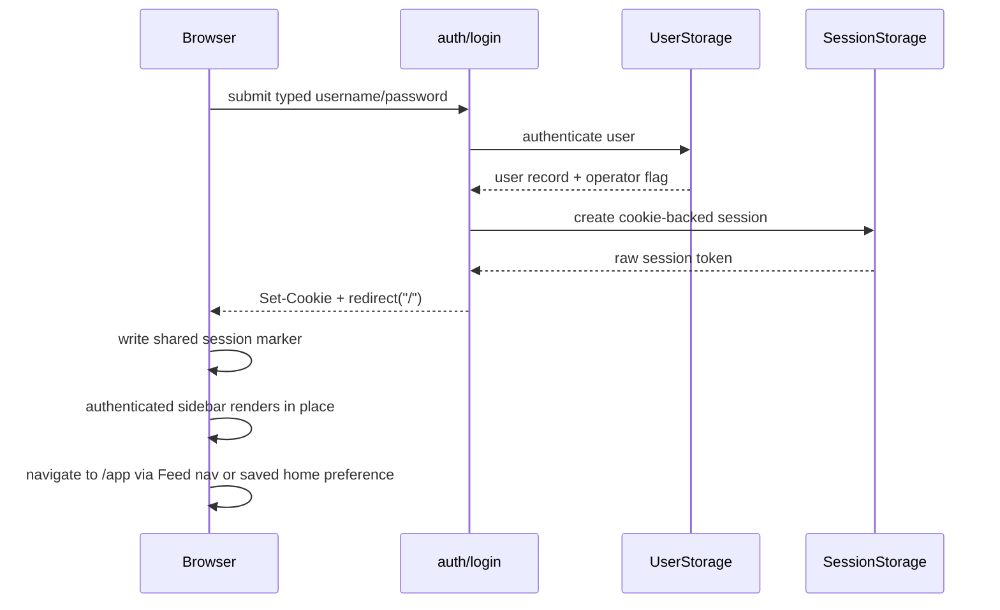

# Authentication

Matrix: `matrix:docs/coverage/csr-e2e-matrix.md#authentication`

## Routes

- `route:/login`
- `route:/register`
- `route:/logout`
- `route:/app`

## Endpoints

- `endpoint:/api/auth/login`
- `endpoint:/api/auth/logout`
- `endpoint:/api/registration/get_policy`
- `endpoint:/api/registration/register`

`/login` submits one typed username/password request. Success creates an
`HttpOnly` session cookie, returns only the operator bit needed for immediate
chrome, and lets the client seed the shared session marker before the server
redirect lands on `/`.

`/register` first reads the site's registration policy. Open sites render the
form directly. Invite-only sites reuse the same route but suppress the submit
form when the URL carries no invite code. Closed sites reject in the server fn.
A successful registration follows the same cookie-only session-establishment
rule as login and seeds the shared client session with `is_operator: false`.

`/logout` is a mount-only action page. It revokes the current session when one
exists, clears the cookie either way, clears the shared client marker on
success, and returns the browser to `/` through router-managed same-document
navigation.

The authenticated cockpit at `/app` is documented separately, but authentication
is what makes it reachable: after login or registration the sidebar flips to the
authenticated chrome, and a Feed navigation can move into `/app` without a fresh
document load.

## Login to authenticated shell

