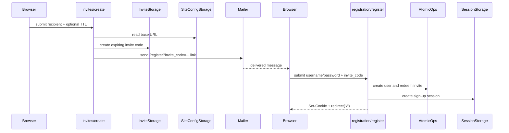

# Invitation registration

Matrix: `matrix:docs/coverage/csr-e2e-matrix.md#invitation-registration`

## Routes

- `route:/invites`
- `route:/register`

## Endpoints

- `endpoint:/api/invites/create`
- `endpoint:/api/invites/list`

`/invites` is the author-side invitation surface. It first checks that the site
is in invite-only mode; otherwise the CSR shell stays mounted but the page
renders the local not-found fallback. When enabled, the page shows invite
metadata only: expiry and redemption timestamps, never the raw invite code.

Creating an invite accepts a recipient email and an optional TTL. The server
validates the configured base URL before minting the invite, stores an expiring
code, and sends the registration link by mail. The code never travels back
through the browser response body.

The invitee side lands on the shared `/register?invite_code=...` route. That
page reads the invite code from the query string once at mount, keeps the user
on the normal registration form when a code is present, and relies on the shared
registration submit path documented in the authentication flow for account
creation and session establishment.

## Invite to registration hand-off

