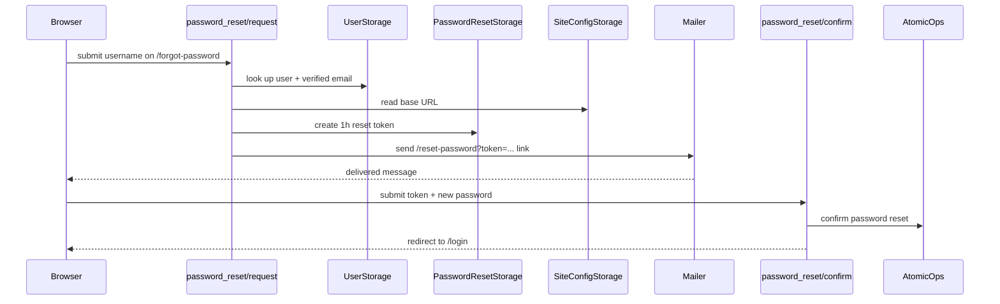

# Password reset

Matrix: `matrix:docs/coverage/csr-e2e-matrix.md#password-reset`

## Routes

- `route:/forgot-password`
- `route:/reset-password`
- `route:/login`

## Endpoints

- `endpoint:/api/password_reset/request`
- `endpoint:/api/password_reset/confirm`

`/forgot-password` is a direct-entry recovery form. On success it deliberately
renders the neutral “check your email” confirmation instead of revealing whether
the username exists. The only explicit error it shows is the validated “contact
the site operator” path when the lookup cannot yield a verified address to send
to.

`/reset-password` reads the reset token from the query string once at mount,
parses it client-side as a typed token before dispatch, accepts the new password
through the normal password field validation, and redirects to `/login` after a
successful reset.

The server creates the reset token only after confirming that the target account
has a verified email and that the site has an absolute base URL. The emailed
link is the only route into the reset token hand-off.

## Reset request to login hand-off

