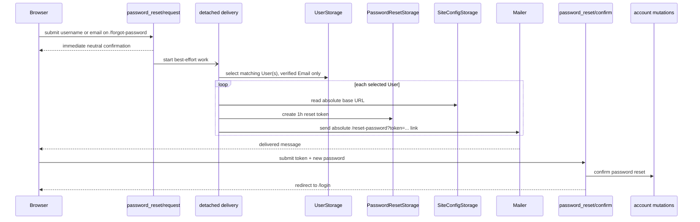

# Password reset

Matrix: `matrix:docs/coverage/csr-e2e-matrix.md#password-reset`

## Routes

- `route:/forgot-password`
- `route:/reset-password`
- `route:/login`

## Endpoints

- `endpoint:/api/password_reset/request`
- `endpoint:/api/password_reset/confirm`

`/forgot-password` is a direct-entry recovery form with one `Username or email`
control. Its typed request boundary treats input containing `@` as an Email and
other input as a Username. Username parsing canonicalizes lowercase; Email
parsing canonicalizes only the DNS domain and preserves the local part. Every
structurally valid request immediately renders the same neutral “check your
email” confirmation, whether or not it selects an eligible User.

The response starts detached best-effort delivery and does not await lookup,
token issuance, base-URL resolution, or mail. Process termination can lose
unfinished delivery; this flow has no durable outbox, retry, or delivery-status
surface. A Username selects its matching User. An Email selects every User with
that exact canonical Email whose address is verified. Each selected User is
processed independently, so one token or mail failure does not prevent delivery
to another verified duplicate match.

`/reset-password` remains the confirmation boundary: it reads the reset token
from the absolute emailed link, validates the new password, atomically claims
the token, replaces the password, revokes sessions, and redirects to `/login`.

## Reset request to login hand-off

