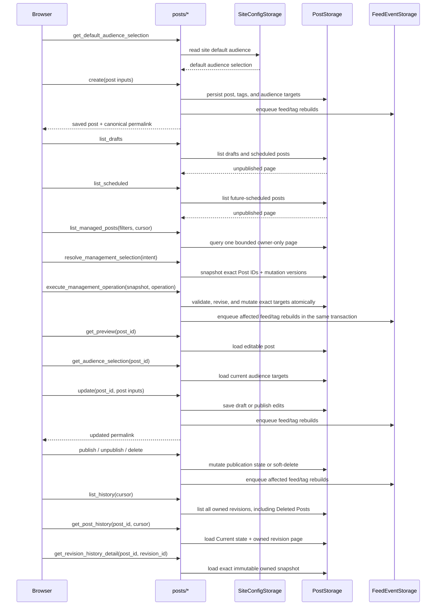

# Post authoring lifecycle

Matrix: `matrix:docs/coverage/csr-e2e-matrix.md#post-authoring-lifecycle`

## Routes

- `route:/posts/new`
- `route:/posts/manage`
- `route:/drafts`
- `route:/scheduled`
- `route:/posts/:post_id/edit`
- `route:/~:username/:year/:month/:day/:slug`
- `route:/history`
- `route:/posts/:post_id/history`
- `route:/posts/:post_id/history/:revision_id`

## Endpoints

- `endpoint:/api/posts/create`
- `endpoint:/api/posts/get_preview`
- `endpoint:/api/posts/update`
- `endpoint:/api/posts/get_default_audience_selection`
- `endpoint:/api/posts/get_audience_selection`
- `endpoint:/api/posts/list_drafts`
- `endpoint:/api/posts/list_scheduled`
- `endpoint:/api/posts/publish`
- `endpoint:/api/posts/delete`
- `endpoint:/api/posts/unpublish`
- `endpoint:/api/posts/list_history`
- `endpoint:/api/posts/get_post_history`
- `endpoint:/api/posts/get_revision_history_detail`
- `endpoint:/api/posts/list_managed_posts`
- `endpoint:/api/posts/resolve_management_selection`
- `endpoint:/api/posts/execute_management_operation`

`/posts/new` waits for the shared session reconcile before it paints the full
composer. The page seeds its audience picker from the site default, lets the
author save a draft or publish immediately, and keeps the route in place after a
successful create by showing the saved slug and a permalink link.

`/posts/manage` is the owner-only compact management workspace. It applies
state, audience, and normalized title/slug filters in storage, retains exact
selections across bounded pages, and confirms atomic Audience replacement or
deletion against immutable Post IDs and mutation versions.

`/drafts` is the mixed unpublished-post queue. It re-reads after publish and
delete mutations, shows both drafts and scheduled posts, and exposes the edit,
publish, delete, and permalink controls from one list row.

`/scheduled` is the Scheduled Post management queue. It waits for authenticated
session confirmation before listing rows, shows only posts whose `published_at`
is still in the future, and hands schedule changes off to the existing editor.

`/posts/:post_id/edit` loads the editable post preview and the current audience
selection together, seeds the shared compose state from that result, and keeps
the save controls branch-specific: drafts can stay drafts or publish, while live
and scheduled posts only offer save. Publishing navigates within the CSR to the
canonical `~`-prefixed permalink. Unpublishing from a permalink page returns to
`/drafts`. Deleting from a permalink soft-deletes the Post and leaves the
success message in place. Deleting from the edit form uses the publication state
classified at the server fetch instant, then navigates within the CSR to
`/drafts` for a Draft, `/scheduled` for a Scheduled Post, or `/app` for a
Published Post. The authoring flow never navigates to the inbound-only bare
`/YYYY/MM/DD/slug` compatibility alias.

`/history` is the owner-only entry point across active and Deleted Posts. It
lists immutable snapshots newest-first and appends cursor pages through **Load
more**. `/posts/:post_id/history` pairs the server-derived Current state with
that Post's snapshots; `/posts/:post_id/history/:revision_id` renders the exact
authored source, trusted rendered representation, scalar metadata, tags,
audiences, and media references captured in that revision. The sidebar reaches
the global route, while each active owner Post exposes its own History action.
Deleted Posts remain discoverable and inspectable from the global list.

Every create, update, publish, unpublish, and published delete also enqueues
feed/tag regeneration work after storage commits, so the visible authoring route
transition and the background timeline rebuild stay coupled.

## Draft, edit, publish, and unpublish

