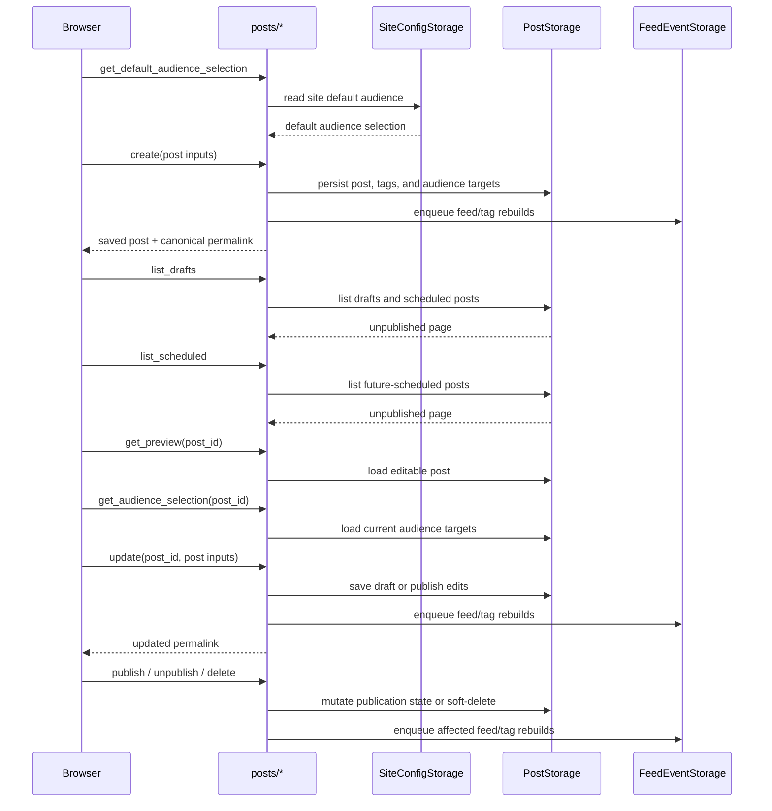

# Post authoring lifecycle

Matrix: `matrix:docs/coverage/csr-e2e-matrix.md#post-authoring-lifecycle`

## Routes

- `route:/posts/new`
- `route:/drafts`
- `route:/scheduled`
- `route:/posts/:post_id/edit`
- `route:/~:username/:year/:month/:day/:slug`

## Endpoints

- `endpoint:/api/posts/create`
- `endpoint:/api/posts/get_preview`
- `endpoint:/api/posts/update`
- `endpoint:/api/posts/get_default_audience_selection`
- `endpoint:/api/posts/get_audience_selection`
- `endpoint:/api/posts/list_drafts`
- `endpoint:/api/posts/list_scheduled`
- `endpoint:/api/posts/publish`
- `endpoint:/api/posts/delete`
- `endpoint:/api/posts/unpublish`

`/posts/new` waits for the shared session reconcile before it paints the full
composer. The page seeds its audience picker from the site default, lets the
author save a draft or publish immediately, and keeps the route in place after a
successful create by showing the saved slug and a permalink link.

`/drafts` is the mixed unpublished-post queue. It re-reads after publish and
delete mutations, shows both drafts and scheduled posts, and exposes the edit,
publish, delete, and permalink controls from one list row.

`/scheduled` is the Scheduled Post management queue. It waits for authenticated
session confirmation before listing rows, shows only posts whose `published_at`
is still in the future, and hands schedule changes off to the existing editor.

`/posts/:post_id/edit` loads the editable post preview and the current audience
selection together, seeds the shared compose state from that result, and keeps
the save controls branch-specific: drafts can stay drafts or publish, while live
and scheduled posts only offer save. Publishing redirects to the canonical
permalink. Unpublishing from a permalink page returns to `/drafts`. Deleting
soft-deletes the post and leaves the success message in place.

Every create, update, publish, unpublish, and published delete also enqueues
feed/tag regeneration work after storage commits, so the visible authoring route
transition and the background timeline rebuild stay coupled.

## Draft, edit, publish, and unpublish

