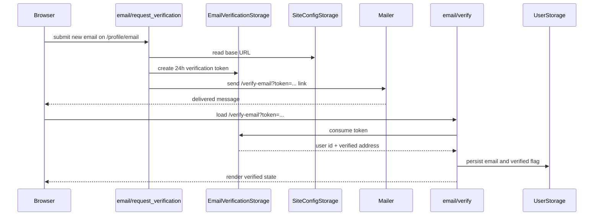

# Profile and email verification

Matrix: `matrix:docs/coverage/csr-e2e-matrix.md#profile-and-email-verification`

## Routes

- `route:/profile`
- `route:/profile/email`
- `route:/verify-email`

## Endpoints

- `endpoint:/api/profile/get`
- `endpoint:/api/profile/update`
- `endpoint:/api/profile/get_default_post_format`
- `endpoint:/api/profile/set_default_post_format`
- `endpoint:/api/profile/get_your_pages_theme`
- `endpoint:/api/profile/set_your_pages_theme`
- `endpoint:/api/profile/reset_your_pages_theme`
- `endpoint:/api/profile/get_site_theme`
- `endpoint:/api/profile/set_site_theme`
- `endpoint:/api/email/request_verification`
- `endpoint:/api/email/verify`

`/profile` reads the authenticated user's stored profile, seeds the editable
display-name and bio fields from that payload, and dispatches updates through
typed optional values so omission clears a field instead of sending a special
sentinel. The same page also owns the persisted default post-format preference:
it loads the saved format once, lets the user choose a new one from the
supported editor formats, and saves only a real parsed token. The profile also
exposes the persisted public-presentation settings. Every authenticated author
selects `Your pages theme`, with `Site default` deleting their optional
override; operators additionally select the site-wide `Site theme`. Each button
writes immediately, then re-reads the persisted typed value.

`/profile/email` is a direct-entry settings page. It reuses the profile payload
to show the current email and verification status, then submits a new address
for verification. The server creates a 24-hour token only after confirming the
site has an absolute base URL, and the mailer sends the
`/verify-email?token=...` link out-of-band.

`/verify-email` reads the token from the query string, parses it client-side as
a typed token before any request, and then calls the verification server fn on
mount. A valid token marks the stored email as verified; a malformed or spent
token renders the error directly on the landing page.

## Verification round trip

